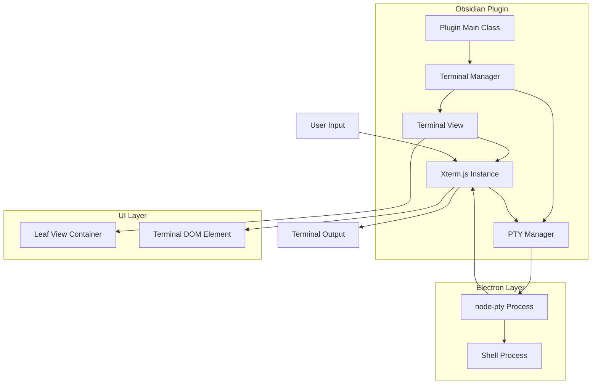

# Design Document

## Overview

本设计文档描述了在 Obsidian 插件中实现集成终端功能的技术架构。该功能将创建一个自定义的 Leaf View，集成 Xterm.js 作为终端 UI，使用 node-pty 创建真实的 shell 会话，并通过适当的方式处理 Electron 环境下的进程间通信。

核心挑战在于在 Obsidian 的沙箱环境中集成需要原生模块支持的 node-pty，以及实现稳定的终端会话管理。

## Architecture

### 系统架构图



### 核心组件关系

1. **Plugin Main Class**: 插件入口，负责初始化和清理
2. **Terminal Manager**: 管理多个终端实例的生命周期
3. **Terminal View**: Obsidian Leaf View 的具体实现
4. **PTY Manager**: 封装 node-pty 操作和进程管理
5. **Xterm.js Instance**: 提供终端 UI 和用户交互

## Components and Interfaces

### 1. Plugin Main Class

```typescript
interface ITerminalPlugin {
	terminalManager: TerminalManager;
	onload(): Promise<void>;
	onunload(): void;
	openTerminal(): void;
}
```

**职责:**

-   插件生命周期管理
-   注册命令和视图类型
-   初始化终端管理器
-   提供用户接口（命令面板、功能区按钮）

### 2. Terminal Manager

```typescript
interface ITerminalManager {
	terminals: Map<string, TerminalSession>;
	createTerminal(id?: string): TerminalSession;
	destroyTerminal(id: string): void;
	getTerminal(id: string): TerminalSession | undefined;
	cleanup(): void;
}

interface TerminalSession {
	id: string;
	ptyProcess: IPty;
	view?: TerminalView;
	isActive: boolean;
}
```

**职责:**

-   管理多个终端会话
-   协调 PTY 进程和视图的生命周期
-   处理终端会话的创建和销毁
-   维护终端状态

### 3. Terminal View (Leaf View)

```typescript
interface ITerminalView extends ItemView {
	terminal: Terminal;
	terminalSession: TerminalSession;
	containerEl: HTMLElement;

	onOpen(): Promise<void>;
	onClose(): Promise<void>;
	getViewType(): string;
	getDisplayText(): string;
	resize(): void;
}
```

**职责:**

-   实现 Obsidian Leaf View 接口
-   管理 Xterm.js 实例
-   处理视图的显示和隐藏
-   响应窗口大小变化

### 4. PTY Manager

```typescript
interface IPTYManager {
	createPTY(options: PTYOptions): IPty;
	destroyPTY(pty: IPty): void;
	getDefaultShell(): string;
	getDefaultOptions(): PTYOptions;
}

interface PTYOptions {
	shell: string;
	args: string[];
	cwd: string;
	env: Record<string, string>;
	cols: number;
	rows: number;
}
```

**职责:**

-   封装 node-pty 操作
-   处理跨平台的 shell 选择
-   管理 PTY 进程生命周期
-   提供错误处理和恢复机制

### 5. Electron Integration Layer

```typescript
interface IElectronBridge {
	isElectronAvailable(): boolean;
	getNodePTY(): typeof import("node-pty") | null;
	requireModule(moduleName: string): any;
	getProcess(): NodeJS.Process;
}
```

**职责:**

-   处理 Electron 环境检测
-   动态加载原生模块
-   提供进程访问接口
-   处理沙箱绕过逻辑

## Data Models

### Terminal Configuration

```typescript
interface TerminalConfig {
	defaultShell: string;
	shellArgs: string[];
	workingDirectory: string;
	environment: Record<string, string>;
	theme: TerminalTheme;
	font: FontConfig;
	behavior: BehaviorConfig;
}

interface TerminalTheme {
	background: string;
	foreground: string;
	cursor: string;
	selection: string;
	colors: {
		black: string;
		red: string;
		green: string;
		yellow: string;
		blue: string;
		magenta: string;
		cyan: string;
		white: string;
		brightBlack: string;
		brightRed: string;
		brightGreen: string;
		brightYellow: string;
		brightBlue: string;
		brightMagenta: string;
		brightCyan: string;
		brightWhite: string;
	};
}

interface FontConfig {
	family: string;
	size: number;
	weight: string;
	lineHeight: number;
}

interface BehaviorConfig {
	cursorBlink: boolean;
	scrollback: number;
	tabStopWidth: number;
	bellSound: boolean;
	rightClickSelectsWord: boolean;
}
```

### Terminal State

```typescript
interface TerminalState {
	id: string;
	isActive: boolean;
	title: string;
	workingDirectory: string;
	processId: number;
	createdAt: Date;
	lastActivity: Date;
	dimensions: {
		cols: number;
		rows: number;
	};
}
```

## Error Handling

### 错误类型定义

```typescript
enum TerminalErrorType {
	PTY_CREATION_FAILED = "PTY_CREATION_FAILED",
	SHELL_NOT_FOUND = "SHELL_NOT_FOUND",
	ELECTRON_NOT_AVAILABLE = "ELECTRON_NOT_AVAILABLE",
	NODE_PTY_NOT_AVAILABLE = "NODE_PTY_NOT_AVAILABLE",
	PROCESS_TERMINATED = "PROCESS_TERMINATED",
	VIEW_CREATION_FAILED = "VIEW_CREATION_FAILED",
}

interface TerminalError {
	type: TerminalErrorType;
	message: string;
	originalError?: Error;
	context?: Record<string, any>;
}
```

### 错误处理策略

1. **PTY 创建失败**: 显示错误消息，提供重试选项和故障排除指南
2. **Shell 进程终止**: 检测进程状态，提供重启选项
3. **原生模块加载失败**: 提供安装指南和替代方案
4. **内存不足**: 实现缓冲区限制和清理机制

### 错误恢复机制

```typescript
interface IErrorRecovery {
	handlePTYError(error: TerminalError): Promise<boolean>;
	handleShellTermination(terminalId: string): Promise<void>;
	handleModuleLoadError(moduleName: string): Promise<void>;
	showErrorNotification(error: TerminalError): void;
}
```

## Testing Strategy

### 单元测试

1. **PTY Manager 测试**

    - 测试不同平台的 shell 选择
    - 测试 PTY 进程创建和销毁
    - 测试错误处理和恢复

2. **Terminal Manager 测试**

    - 测试多终端会话管理
    - 测试会话生命周期
    - 测试状态同步

3. **Terminal View 测试**
    - 测试视图创建和销毁
    - 测试 Xterm.js 集成
    - 测试用户交互处理

### 集成测试

1. **端到端终端功能测试**

    - 测试完整的命令执行流程
    - 测试输入输出处理
    - 测试窗口大小调整

2. **Obsidian 集成测试**
    - 测试 Leaf View 集成
    - 测试插件生命周期
    - 测试多工作区支持

### 性能测试

1. **内存使用测试**

    - 监控长时间运行的内存使用
    - 测试多终端实例的资源消耗
    - 测试缓冲区管理效率

2. **响应性测试**
    - 测试大量输出的处理性能
    - 测试用户输入的响应延迟
    - 测试窗口调整的性能

### 兼容性测试

1. **跨平台测试**

    - Windows (PowerShell, CMD)
    - macOS (bash, zsh)
    - Linux (bash, sh)

2. **Obsidian 版本兼容性**
    - 测试不同 Obsidian 版本的兼容性
    - 测试 API 变更的影响

## Implementation Considerations

### Electron 沙箱绕过

由于 Obsidian 可能限制对 Node.js 原生模块的访问，需要实现以下策略：

1. **动态模块加载**: 使用 `window.require` 或类似机制动态加载 node-pty
2. **进程检测**: 检测当前是否运行在 Electron 环境中
3. **降级方案**: 如果原生模块不可用，提供基本的命令执行功能

### 性能优化

1. **缓冲区管理**: 实现智能的输出缓冲和滚动机制
2. **懒加载**: 延迟加载 Xterm.js 和相关资源
3. **内存清理**: 定期清理不活跃的终端会话

### 安全考虑

1. **命令过滤**: 可选的危险命令警告机制
2. **工作目录限制**: 限制终端的工作目录范围
3. **环境变量清理**: 清理敏感的环境变量

### 用户体验优化

1. **主题集成**: 与 Obsidian 主题系统集成
2. **快捷键支持**: 实现常用的终端快捷键
3. **状态持久化**: 保存和恢复终端会话状态
4. **多标签支持**: 支持多个终端标签页
